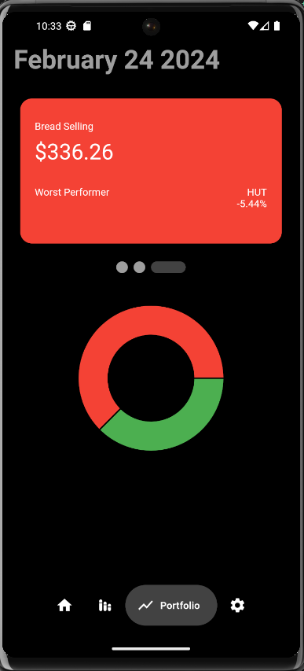

# portfolio-app

## Unfinished Mobile app

Intro to Flutter mobile app build. Focusing on learning the widgets and language.  
Took static flutter app tutorial from [https://www.youtube.com/watch?v=Gz3IEFe5PIw](https://www.youtube.com/watch?v=Gz3IEFe5PIw) and made the following improvements:  

1. Added 3 screens (Charts, Settings, Porfolio)
2. Changed hard coded static values, to fetch real time data from the following APIs:
  * [Binance API](https://binance-docs.github.io/apidocs/spot/en/#introduction)
  * [Finnhub API](https://finnhub.io/docs/api/introduction)
3. Setup User Authentication and Database storage with [Supabase](https://supabase.com/)
4. Added loading screens, splash pages and portfolio tracking on top on real time stock data

## Screenshots

  
  

